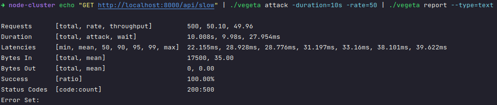
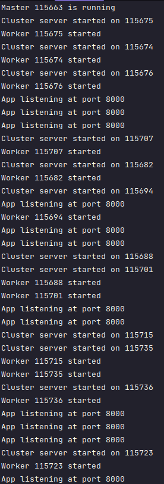
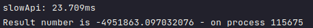
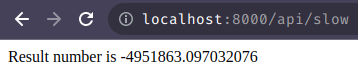

# Optimizing Nodejs app`s performance with clustering

- required `node`

#### i'm use `node` `18.16.0`

- run 
    - `node src/cluster.js`

### install `vegeta` for attack request

- installation 

```bash
cd ~/Downloads
wget https://github.com/tsenart/vegeta/releases/download/v12.8.3/vegeta-12.8.3-linux-amd64.tar.gz
tar -zxvf vegeta-12.8.3-linux-amd64.tar.gz
chmod +x vegeta
./vegeta --version
```

### output this command `echo "GET http://localhost:8000/api/slow" | ./vegeta attack -duration=10s -rate=50 | ./vegeta report --type=text`



### output node running apt port 8000



### time of API



### result number

